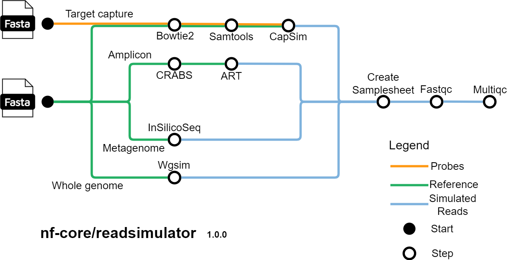

#  

[](https://github.com/nf-core/readsimulator/actions?query=workflow%3A%22nf-core+CI%22)
[](https://github.com/nf-core/readsimulator/actions?query=workflow%3A%22nf-core+linting%22)[](https://nf-co.re/readsimulator/results)[](https://doi.org/10.5281/zenodo.XXXXXXX)

[](https://www.nextflow.io/)
[](https://docs.conda.io/en/latest/)
[](https://www.docker.com/)
[](https://sylabs.io/docs/)
[](https://tower.nf/launch?pipeline=https://github.com/nf-core/readsimulator)

[](https://nfcore.slack.com/channels/readsimulator)[](https://twitter.com/nf_core)[](https://mstdn.science/@nf_core)[](https://www.youtube.com/c/nf-core)

## Introduction

**nf-core/readsimulator** is a pipeline to simulate sequencing reads. The pipeline currently supports simulating amplicon, target capture, metagenome, and wholegenome data. It takes a samplesheet with sample names and seeds for random generation to produce simulated FASTQ files and a samplesheet that contains the paths to the FASTQ files.

<p align="center">
    
</p>

### Amplicon simulation steps

1. Create reference database for amplicon-based sequencing ([`CRABS`](https://github.com/gjeunen/reference_database_creator))
2. Simulate amplicon Illumina reads ([`art_illumina`](https://manpages.debian.org/testing/art-nextgen-simulation-tools/art_illumina.1.en.html))
3. Create samplesheet with sample names and paths to simulated read files
4. Simulated read QC ([`FastQC`](https://www.bioinformatics.babraham.ac.uk/projects/fastqc/))
5. Present QC for simulated reads ([`MultiQC`](http://multiqc.info/))

### Target capture simulation steps

1. Align probes to genome ([`Bowtie2`](https://bowtie-bio.sourceforge.net/bowtie2/index.shtml))
2. Get SAM index ([`SAMtools`](https://www.htslib.org/))
3. Simulate target capture reads (Illumina (default) or Pacbio) ([`Japsa capsim`](https://japsa.readthedocs.io/en/latest/tools/jsa.sim.capsim.html))
4. Create samplesheet with sample names and paths to simulated read files
5. Simulated read QC ([`FastQC`](https://www.bioinformatics.babraham.ac.uk/projects/fastqc/))
6. Present QC for simulated reads ([`MultiQC`](http://multiqc.info/))

### Metagenome simulation steps

1. Simulate metagenome Illumina reads ([`InsilicoSeq Generate`](https://insilicoseq.readthedocs.io/en/latest/))
2. Create samplesheet with sample names and paths to simulated read files
3. Simulated read QC ([`FastQC`](https://www.bioinformatics.babraham.ac.uk/projects/fastqc/))
4. Present QC for simulated reads ([`MultiQC`](http://multiqc.info/))

### Wholegenome simulation steps

1. Simulate wholegenome reads ([`wgsim`](https://github.com/lh3/wgsim))
2. Create samplesheet with sample names and paths to simulated read files
3. Simulated read QC ([`FastQC`](https://www.bioinformatics.babraham.ac.uk/projects/fastqc/))
4. Present QC for simulated reads ([`MultiQC`](http://multiqc.info/))

## Usage

> [!NOTE]
> If you are new to Nextflow and nf-core, please refer to [this page](https://nf-co.re/docs/usage/installation) on how to set-up Nextflow. Make sure to [test your setup](https://nf-co.re/docs/usage/introduction#how-to-run-a-pipeline) with `-profile test` before running the workflow on actual data.

First, prepare a samplesheet with your input data that looks as follows:

`samplesheet.csv`:

```csv
sample,seed
sample_1,1
sample_2,4
```

Each row represents an output sample.

Now, you can run the pipeline using:

```bash
nextflow run nf-core/readsimulator \
   -profile <docker/singularity/.../institute> \
   --input samplesheet.csv \
   --amplicon \
   --outdir <OUTDIR>
```

> [!WARNING]
> Please provide pipeline parameters via the CLI or Nextflow `-params-file` option. Custom config files including those provided by the `-c` Nextflow option can be used to provide any configuration _**except for parameters**_;
> see [docs](https://nf-co.re/usage/configuration#custom-configuration-files).

For more details and further functionality, please refer to the [usage documentation](https://nf-co.re/readsimulator/usage) and the [parameter documentation](https://nf-co.re/readsimulator/parameters).

## Pipeline output

To see the results of an example test run with a full size dataset refer to the [results](https://nf-co.re/readsimulator/results) tab on the nf-core website pipeline page.
For more details about the output files and reports, please refer to the
[output documentation](https://nf-co.re/readsimulator/output).

## Credits

nf-core/readsimulator was originally written by [Adam Bennett](https://github.com/a4000) for use at the [Minderoo Foundation's OceanOmics project](https://www.minderoo.org/oceanomics).

We thank the following people for their extensive assistance in the development of this pipeline (in alphabetical order):

- [Lauren Huet](https://github.com/LaurenHuet/)
- [Philipp Bayer](https://github.com/philippbayer)

## Contributions and Support

If you would like to contribute to this pipeline, please see the [contributing guidelines](.github/CONTRIBUTING.md).

For further information or help, don't hesitate to get in touch on the [Slack `#readsimulator` channel](https://nfcore.slack.com/channels/readsimulator) (you can join with [this invite](https://nf-co.re/join/slack)).

## Citations

<!-- TODO nf-core: Add citation for pipeline after first release. Uncomment lines below and update Zenodo doi and badge at the top of this file. -->
<!-- If you use nf-core/readsimulator for your analysis, please cite it using the following doi: [10.5281/zenodo.XXXXXX](https://doi.org/10.5281/zenodo.XXXXXX) -->

<!-- TODO nf-core: Add bibliography of tools and data used in your pipeline -->

An extensive list of references for the tools used by the pipeline can be found in the [`CITATIONS.md`](CITATIONS.md) file.

You can cite the `nf-core` publication as follows:

> **The nf-core framework for community-curated bioinformatics pipelines.**
>
> Philip Ewels, Alexander Peltzer, Sven Fillinger, Harshil Patel, Johannes Alneberg, Andreas Wilm, Maxime Ulysse Garcia, Paolo Di Tommaso & Sven Nahnsen.
>
> _Nat Biotechnol._ 2020 Feb 13. doi: [10.1038/s41587-020-0439-x](https://dx.doi.org/10.1038/s41587-020-0439-x).
